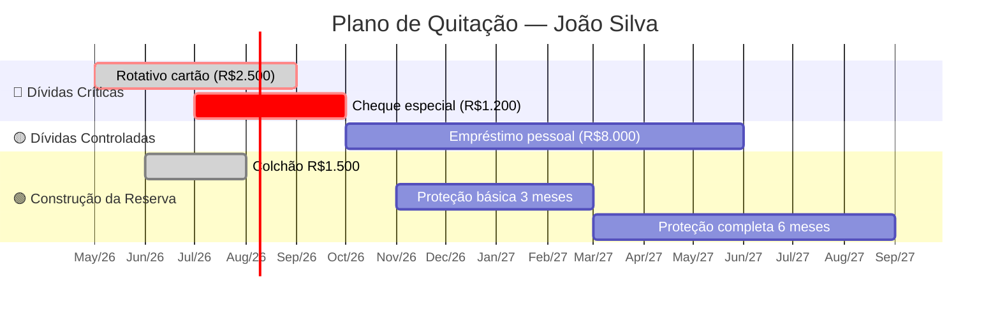
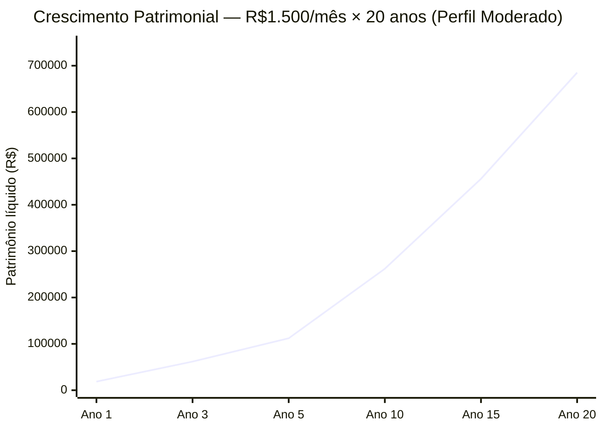
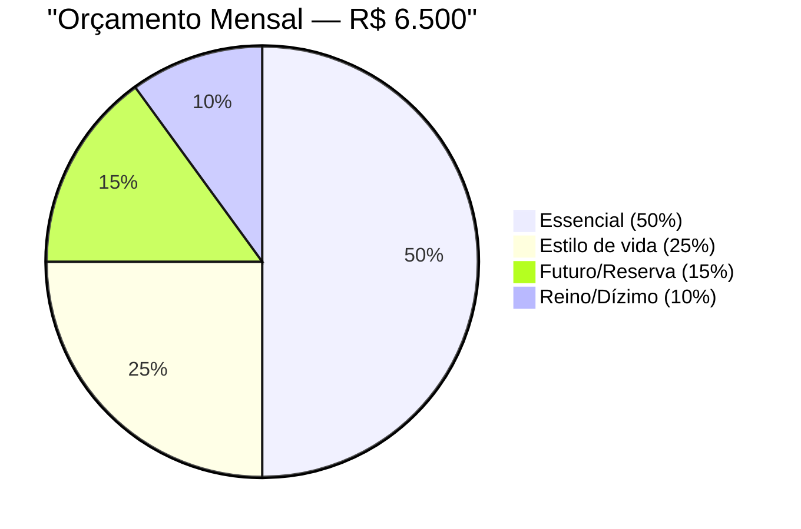
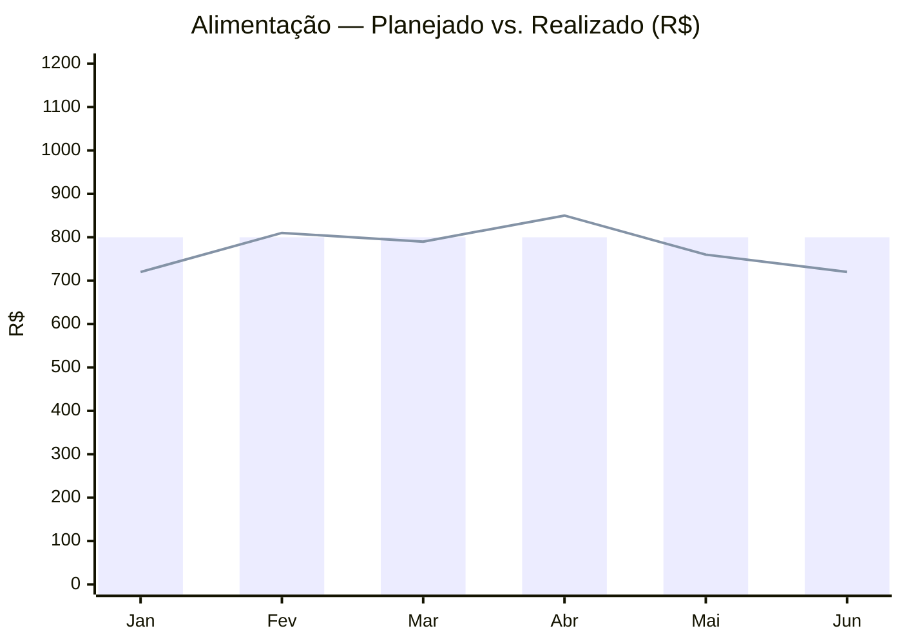

# Sistema de Visualização Financeira — MordomIA

## Propósito

Este arquivo define o protocolo completo de geração de recursos visuais do sistema MordomIA. Toda skill pode gerar qualquer tipo de visual — seja proativamente (quando os dados se beneficiam de representação visual) ou sob demanda do usuário.

---

## PROTOCOLO DE DETECÇÃO

### Gatilhos de Demanda Explícita do Usuário

O sistema detecta qualquer solicitação de visual e gera o tipo mais adequado:

| O usuário diz | Interpretar como |
|---|---|
| "mostra em gráfico", "gera um gráfico", "quero ver no gráfico" | Gráfico de linha ou barras conforme contexto |
| "faz uma tabela", "coloca em tabela", "tabela comparativa" | Tabela Markdown estruturada |
| "cronograma", "timeline", "quanto tempo leva", "mapa do plano" | Gantt Mermaid |
| "como vai ficar a distribuição", "pizza", "composição" | Pie chart Mermaid |
| "como evolui", "crescimento", "curva", "trajetória" | Gráfico de linha xychart |
| "compara os dois", "lado a lado", "cenário A vs B" | Tabela comparativa ou gráfico duplo |
| "me mostra visualmente", "visualiza isso", "de forma visual" | Escolher o mais adequado proativamente |
| "quanto a dívida vai cair", "amortização", "mês a mês" | Tabela de amortização + gráfico de linha |
| "fluxo", "mapa de decisão", "como funciona" | Flowchart Mermaid |

### Geração Proativa (Sem Pedido Explícito)

O sistema oferece visual espontaneamente quando:
- Apresenta um plano com múltiplas fases ou meses → Gantt ou tabela cronológica
- Apresenta distribuição de orçamento em blocos → Pie chart ou barra visual
- Apresenta simulação de crescimento patrimonial → Gráfico de linha
- Apresenta comparativo de estratégias → Tabela lado a lado
- Apresenta cronograma de quitação → Gantt + tabela de amortização
- Apresenta progresso de meta → Barra de progresso ASCII

---

## BIBLIOTECA DE TIPOS VISUAIS

### TIPO 1 — Gráfico de Barras (Mermaid xychart-beta)

**Ideal para:** Distribuição do orçamento por bloco, comparativo de categorias, ranking de dívidas por taxa.

```
xychart-beta
    title "Distribuição do Orçamento Mensal — R$ 6.500"
    x-axis ["Reino 10%", "Essencial 50%", "Estilo 25%", "Futuro 15%"]
    y-axis "Reais (R$)" 0 --> 4000
    bar [650, 3250, 1625, 975]
```

**Template geração (substituir valores):**
```
xychart-beta
    title "[TÍTULO]"
    x-axis ["[LABEL1]", "[LABEL2]", "[LABEL3]", "[LABEL4]"]
    y-axis "[EIXO Y]" 0 --> [MÁXIMO]
    bar [[V1], [V2], [V3], [V4]]
```

---

### TIPO 2 — Gráfico de Linha (Mermaid xychart-beta)

**Ideal para:** Crescimento do patrimônio ao longo do tempo, evolução da reserva mês a mês, redução de dívida, curva de aportes acumulados.

```
xychart-beta
    title "Crescimento da Reserva — Meta: R$ 18.000"
    x-axis ["M1", "M3", "M6", "M9", "M12", "M18", "M24"]
    y-axis "Saldo (R$)" 0 --> 20000
    line [1000, 3000, 6000, 9000, 12000, 18000, 18000]
```

**Template para crescimento patrimonial com juros compostos:**
```
xychart-beta
    title "Crescimento Patrimonial — R$[APORTE]/mês × [ANOS] anos"
    x-axis ["Ano 1", "Ano 2", "Ano 5", "Ano 10", "Ano 15", "Ano 20"]
    y-axis "Patrimônio líquido (R$)" 0 --> [MÁXIMO]
    line [[ANO1], [ANO2], [ANO5], [ANO10], [ANO15], [ANO20]]
```

**Template para amortização (dívida caindo):**
```
xychart-beta
    title "Evolução da Dívida — Método [AVALANCHE/BOLA DE NEVE]"
    x-axis ["Hoje", "M3", "M6", "M9", "M12", "M18", "Quitado"]
    y-axis "Saldo devedor (R$)" 0 --> [SALDO_INICIAL]
    line [[SALDO], [M3], [M6], [M9], [M12], [M18], 0]
```

---

### TIPO 3 — Gráfico de Pizza (Mermaid pie)

**Ideal para:** Composição do orçamento, alocação de carteira de investimentos, distribuição de dívidas.

```
pie title "Composição do Orçamento — R$ 6.500"
    "Reino (10%)" : 10
    "Essencial (50%)" : 50
    "Estilo de vida (25%)" : 25
    "Futuro/Reserva (15%)" : 15
```

**Template carteira de investimentos:**
```
pie title "Carteira de Investimentos — Perfil [PERFIL]"
    "Renda Fixa — Reserva ([X]%)" : [X]
    "Renda Fixa — Crescimento ([X]%)" : [X]
    "Renda Variável — ETFs ([X]%)" : [X]
    "Previdência PGBL/VGBL ([X]%)" : [X]
```

---

### TIPO 4 — Gantt / Cronograma (Mermaid gantt)

**Ideal para:** Plano de quitação de dívidas com fases, cronograma de metas financeiras, roadmap de jornada financeira.

```
gantt
    title Plano de Quitação — 18 meses
    dateFormat YYYY-MM
    axisFormat %b/%Y

    section Protocolo Estancar Sangria
    Zerar rotativo cartão    :done,    rot,  2026-05, 2026-09
    Quitar cheque especial   :active,  che,  2026-07, 2026-10

    section Construção de Base
    Colchão mínimo R$1.500   :         col,  2026-06, 2026-08
    Quitar empréstimo pessoal:         emp,  2026-10, 2027-04

    section Proteção Ativa
    Reserva 3 meses          :         res,  2026-11, 2027-05
    Reserva 6 meses          :         res2, 2027-05, 2027-11
```

**Template para jornada financeira por estados:**
```
gantt
    title Jornada Financeira — [NOME]
    dateFormat YYYY-MM
    axisFormat %b/%Y

    section SOBREVIVÊNCIA → ORGANIZAÇÃO
    Estancar sangria (juros)    :done,    s1, [DATA_INICIO], [DURAÇÃO]
    Orçamento estruturado       :active,  s2, [DATA],        [DURAÇÃO]

    section ORGANIZAÇÃO → ESTABILIZAÇÃO
    Quitar dívidas caras        :         s3, [DATA],  [DURAÇÃO]
    Reserva básica 3 meses      :         s4, [DATA],  [DURAÇÃO]

    section ESTABILIZAÇÃO → EXPANSÃO
    Reserva completa 6 meses    :         s5, [DATA],  [DURAÇÃO]
    Iniciar investimentos        :         s6, [DATA],  [DURAÇÃO]
```

---

### TIPO 5 — Flowchart de Decisão (Mermaid graph)

**Ideal para:** Jornada financeira, árvore de decisão (investir vs. quitar, CLT vs. PJ), protocolo de emergência.

```
graph TD
    A[Tem dívida com taxa > Selic?] -->|Sim| B[QUITAR PRIMEIRO]
    A -->|Não| C[Tem reserva de 3 meses?]
    C -->|Não| D[CONSTRUIR RESERVA]
    C -->|Sim| E[INVESTIR]
    B --> F{Taxa > 100% a.a.?}
    F -->|Sim rotativo/cheque| G[🔴 Protocolo Estancar Sangria]
    F -->|Não crédito pessoal| H[🟡 Método Avalanche]
```

**Template jornada financeira:**
```
graph LR
    A([💸 Hoje]) --> B{Estado Financeiro}
    B -->|Déficit/Rotativo| C[🔴 SOBREVIVÊNCIA]
    B -->|Organizado| D[🟡 ORGANIZAÇÃO]
    B -->|Reserva ativa| E[🟢 ESTABILIZAÇÃO]
    C --> F[Estancar Sangria\n30-90 dias]
    F --> D
    D --> G[Quitar dívidas\nConstruir reserva]
    G --> E
    E --> H[🔵 EXPANSÃO\nInvestimentos ativos]
    H --> I[⭐ LEGADO]
```

---

### TIPO 6 — Tabela de Amortização (Markdown)

**Ideal para:** Mostrar exatamente quanto vai da dívida cada mês, quando quita cada dívida, quanto vai em juros vs. principal.

```markdown
| Mês | Saldo Inicial | Juros (36,5%/mês) | Amortização | Saldo Final | Reserva |
|-----|--------------|-------------------|-------------|-------------|---------|
| Mai/26 | R$ 2.500 | R$ 912 | R$ 600 | R$ 2.812 | R$ 100 |
| Jun/26 | R$ 2.812 | R$ 1.026 | R$ 700 | R$ 3.138 | R$ 200 |
| ... | ... | ... | ... | ... | ... |
```

> Nota: Tabela com rotativo em que pagamento < juros mostra dívida CRESCENDO — impacto visual poderoso.

**Com Protocolo Estancar Sangria (pagamento acelerado):**

```markdown
| Mês | Saldo Inicial | Juros | Aporte | Saldo Final | Acumulado Pago | % Quitado |
|-----|--------------|-------|--------|-------------|----------------|-----------|
| Mai/26 | R$ 2.500 | R$ 912 | R$ 600 | R$ 2.812 | R$ 600 | 24% |
| Jun/26 | R$ 2.812 | R$ 60 | R$ 600 | R$ 2.272 | R$ 1.200 | — |
```

---

### TIPO 7 — Tabela Comparativa de Cenários

**Ideal para:** Pagar mínimo vs. pagar agressivo, investir vs. quitar, CDI vs. IPCA+5% vs. IBOVESPA.

```markdown
| | Cenário A — Mínimo | Cenário B — R$600/mês | Cenário C — R$900/mês |
|---|---|---|---|
| **Prazo** | 42 meses | 6 meses | 4 meses |
| **Total pago** | R$ 6.300 | R$ 3.600 | R$ 3.600 |
| **Total em juros** | R$ 3.800 | R$ 600 | R$ 200 |
| **Economia vs. A** | — | R$ 3.200 | R$ 3.600 |
| **Data de quitação** | Nov/29 | Nov/26 | Set/26 |
```

**Template investimentos — retorno líquido por produto:**

```markdown
| Produto | Rentabilidade Bruta | IR | Taxa | Retorno Líquido | Liquidez |
|---------|--------------------|----|------|-----------------|----------|
| Tesouro Selic | 14,50% a.a. | 15% | — | ~12,3% a.a. | D+1 |
| CDB 110% CDI | ~15,9% a.a. | 15% | — | ~13,5% a.a. | Vencimento |
| LCI 90% CDI | ~13,0% a.a. | Isento | — | ~13,0% a.a. | 90 dias |
| Poupança | ~6,5% a.a. | Isenta | — | ~6,5% a.a. | D+0 |
| PGBL | Selic — taxa | 10-27,5% | ~0,8% | Variável | Vencimento |
```

---

### TIPO 8 — Barra de Progresso ASCII

**Ideal para:** Progresso de metas, % de reserva construída, % de dívida quitada, composição visual simples.

```
PROGRESSO DAS METAS

Reserva emergência: [████████░░░░░░░░░░░░] 40% — R$ 7.200 / R$ 18.000
Dívida cartão:     [██████████████░░░░░░] 70% quitada — R$ 750 restantes
Dívida empréstimo: [████░░░░░░░░░░░░░░░░] 20% quitada — R$ 6.400 restantes
Dízimo:            [████████████████████] 100% ✅ praticado
Oferta:            [██████████░░░░░░░░░░] 50% — crescendo para 7%
```

**Template geração (calcular % automaticamente):**
```
[Nome da meta]: [█ × (% ÷ 5)░ × (20 - % ÷ 5)] [%]% — R$ [ATUAL] / R$ [META]
Exemplo 40%:    [████████░░░░░░░░░░░░] 40%
Exemplo 75%:    [███████████████░░░░░] 75%
Exemplo 100%:   [████████████████████] 100% ✅
```

---

### TIPO 9 — Termômetro de Comprometimento

**Ideal para:** Mostrar taxa de comprometimento visualmente, onde o usuário está vs. o saudável.

```
TERMÔMETRO DE COMPROMETIMENTO

Sua situação: 108%
━━━━━━━━━━━━━━━━━━━━━━━━━━━━━━━━━━━━━━━━━━━━━━━━━━━━━━━━━━
[Saudável <70%]  [Atenção 70-90%]  [Risco 90-100%]  [⚠️ CRÍTICO >100%]
░░░░░░░░░░░░░░   ░░░░░░░░░░░░░░░   ░░░░░░░░░░░░░░░   ████████████████▶ 108%
━━━━━━━━━━━━━━━━━━━━━━━━━━━━━━━━━━━━━━━━━━━━━━━━━━━━━━━━━━
→ Você está R$ 400/mês acima da sua capacidade.
```

---

### TIPO 10 — Sparkline de Evolução Mensal

**Ideal para:** Mostrar tendência de uma categoria ao longo dos meses na rotina financeira mensal.

```
Alimentação — Últimos 6 meses (teto: R$ 800)
Jan: R$ 720  ▄
Fev: R$ 810  █ ⚠️ estouro
Mar: R$ 790  █
Abr: R$ 850  █▄ ⚠️ estouro
Mai: R$ 760  █
Jun: R$ 720  ▄ ← você aqui

Tendência: ↓ melhorando  |  Desvio médio: +6,2%  |  Causa identificada: delivery
```

---

## PROTOCOLO DE SELEÇÃO AUTOMÁTICA

Quando o usuário pede um visual sem especificar o tipo, o sistema escolhe:

```
SE dado = distribuição percentual (orçamento, carteira):
  → Pie chart (Mermaid) + tabela resumo

SE dado = evolução ao longo do tempo (reserva crescendo, dívida caindo):
  → Gráfico de linha (Mermaid xychart-beta)

SE dado = comparativo entre valores (categorias, produtos):
  → Gráfico de barras (Mermaid xychart-beta) OU tabela comparativa

SE dado = cronograma com fases e datas:
  → Gantt (Mermaid) OU tabela por mês

SE dado = fluxo de decisão ou jornada:
  → Flowchart (Mermaid graph)

SE dado = progresso de uma meta:
  → Barra de progresso ASCII

SE dado = tendência de uma série histórica:
  → Sparkline ASCII OU linha xychart

SE contexto = ambiente sem suporte a Mermaid (incerto):
  → Preferir ASCII + Markdown — universalmente compatível
  → Oferecer versão Mermaid adicionalmente: "Se seu ambiente suporta Mermaid, posso gerar versão gráfica."
```

---

## PROTOCOLO DE RESPOSTA A PEDIDO CUSTOM

Quando o usuário pede um gráfico específico com seus dados:

```
PASSO 1 — Identificar o tipo de dado:
  Série temporal? → Linha ou Gantt
  Categorias? → Barras ou Pizza
  Decisão? → Flowchart

PASSO 2 — Solicitar dados se ausentes (máx. 2 perguntas):
  "Para gerar o gráfico de crescimento, preciso:
   1. Valor do aporte mensal
   2. Quantos anos quer projetar"

PASSO 3 — Gerar em dois formatos:
  a) Mermaid (para interfaces que suportam)
  b) Tabela ASCII (fallback universal)

PASSO 4 — Interpretar o visual:
  Nunca entregue apenas o gráfico. Sempre 1-2 frases de interpretação:
  "O gráfico mostra que com R$500/mês você atinge R$200k em 15 anos.
   Dobrando o aporte para R$1.000, chega ao mesmo valor em apenas 10 anos —
   5 anos a menos pela metade a mais de esforço mensal."
```

---

## EXEMPLOS COMPLETOS POR SKILL

### Para `/pessoal-plano-dividas-reserva` — Cronograma de Quitação



### Para `/pessoal-estrategia-investimentos` — Crescimento Patrimonial



### Para `/pessoal-orcamento-domestico` — Distribuição do Orçamento



### Para `/pessoal-rotina-financeira-mensal` — Comparativo Mensal



---

## NOTA SOBRE COMPATIBILIDADE

| Ambiente | Mermaid | ASCII | Markdown |
|----------|---------|-------|----------|
| Claude.ai | ✅ Nativo | ✅ | ✅ |
| Cursor / VS Code | ✅ Com extensão | ✅ | ✅ |
| GitHub | ✅ Nativo | ✅ | ✅ |
| Obsidian | ✅ Com plugin | ✅ | ✅ |
| Terminal / Chat | ❌ | ✅ | ✅ |
| Notion | ❌ | ✅ | ✅ |

**Regra:** Em caso de dúvida sobre o ambiente, gerar sempre **ambos** — Mermaid primeiro, ASCII como fallback na sequência. O usuário usa o que funcionar melhor para ele.
